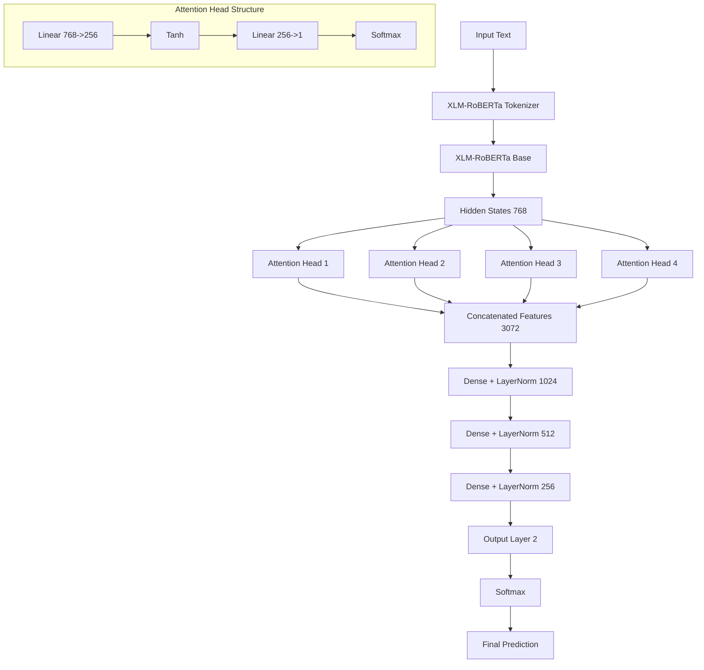

# Abusive Tamil and Malayalam Text Classification

## Overview

This project aims to detect abusive comments targeted at women on social media platforms, specifically focusing on YouTube comments in Tamil and Malayalam. The model is designed to classify comments as "Abusive" or "Non-Abusive" using a deep learning architecture built on top of XLM-RoBERTa, a multilingual transformer model. The dataset includes comments in Tamil and Malayalam, annotated for abusive and non-abusive content.

### Key Features:
- **Language Support**: Tamil and Malayalam.
- **Task**: Binary classification (Abusive vs. Non-Abusive).
- **Model**: XLM-RoBERTa with multi-head attention and deeper classification layers.

## Directory Structure

```
project/
│
├── data/
│   ├── train.csv             # Training data with labels
│   ├── development.csv       # Validation data with labels
│   ├── submission.csv        # Submission data without labels
│   └── processed/            # Folder for processed datasets (e.g., tokenized data)
│
├── model/
│   ├── enhanced_model.py     # Model architecture file (e.g., EnhancedTextEncoder)
│   └── pretrained_model/     # Folder for storing pre-trained models and weights
│
├── output/
│   ├── predictions/          # Folder for storing predictions (e.g., submission_with_predictions.csv)
│   └── logs/                 # Folder for logs (e.g., training logs)
│
├── scripts/
│   ├── train.py              # Script for training the model
│   ├── evaluate.py           # Script for evaluation during training
│   ├── infer.py              # Script for generating predictions on submission data
│   └── utils.py              # Helper functions for data loading, preprocessing, etc.
│
├── notebooks/                # Folder for Jupyter notebooks (optional)
│   └── data_exploration.ipynb # Data exploration and analysis notebooks (optional)
│
├── requirements.txt          # File for dependencies
├── README.md                 # Project description and instructions
└── config.yaml               # Configuration file (optional, for model parameters, paths, etc.)
```

## Model Architecture

The model is built using XLM-RoBERTa as the base, with an additional multi-head attention mechanism to enhance the feature extraction. The model has the following components:

1. **XLM-RoBERTa Transformer**: A pre-trained multilingual model for extracting contextualized embeddings from text in Tamil and Malayalam.
2. **Multi-Head Attention**: Multiple attention heads are used to capture different aspects of the input text, allowing the model to focus on various parts of the text.
3. **Deeper Classification Layers**: The model includes several fully connected layers with residual connections and dropout for regularization. These layers help refine the classification between abusive and non-abusive comments.



## Setup

### Requirements

To install the necessary dependencies, create a virtual environment and install the required packages using the `requirements.txt` file.

1. **Create Virtual Environment**:
   ```bash
   python3 -m venv env
   source env/bin/activate  # On Windows use `env\Scripts\activate`
   ```

2. **Install Dependencies**:
   ```bash
   pip install -r requirements.txt
   ```

### Datasets

The datasets are provided as CSV files:
- `train.csv`: Training data with labeled comments (Abusive/Non-Abusive).
- `development.csv`: Validation data with labels.
- `submission.csv`: Unlabeled test data for generating predictions.

### Model Training

To train the model, run the `train.py` script:

```bash
python scripts/train.py
```

This will train the model on the training data and validate it on the development data. The model weights will be saved in the `output/` directory.

### Model Evaluation

To evaluate the model on the validation set, use the `evaluate.py` script:

```bash
python scripts/evaluate.py
```

### Inference (Prediction)

To generate predictions on the submission dataset, run the `infer.py` script:

```bash
python scripts/infer.py
```

This will produce a CSV file with the predictions (Abusive or Non-Abusive) for each comment in the submission set.

## Example Usage

After training, the model can be used to predict whether a comment is abusive or not:

```python
from transformers import XLMRobertaTokenizer
from model.enhanced_model import EnhancedTextEncoder
import torch

# Initialize the model and tokenizer
model = EnhancedTextEncoder()
tokenizer = XLMRobertaTokenizer.from_pretrained('xlm-roberta-base')

# Sample input (Tamil and Malayalam)
input_text = "வணக்கம், இது ஒரு சோதனை உரை"  # Tamil example

# Tokenize the input text
inputs = tokenizer(input_text, return_tensors='pt', truncation=True, padding=True, max_length=128)

# Forward pass through the model
model.eval()
with torch.no_grad():
    outputs = model(inputs['input_ids'], inputs['attention_mask'])
    prediction = torch.softmax(outputs, dim=1)

# Print the prediction
print(f"Non-Abusive: {prediction[0][0]:.4f}")
print(f"Abusive: {prediction[0][1]:.4f}")
```

## License

This project is licensed under the MIT License - see the [LICENSE](LICENSE) file for details.

## Acknowledgements

- The pre-trained XLM-RoBERTa model is provided by Hugging Face and fine-tuned for this specific task.
- The dataset has been created for the purpose of detecting abusive language on social media platforms, specifically focusing on comments targeting women.
