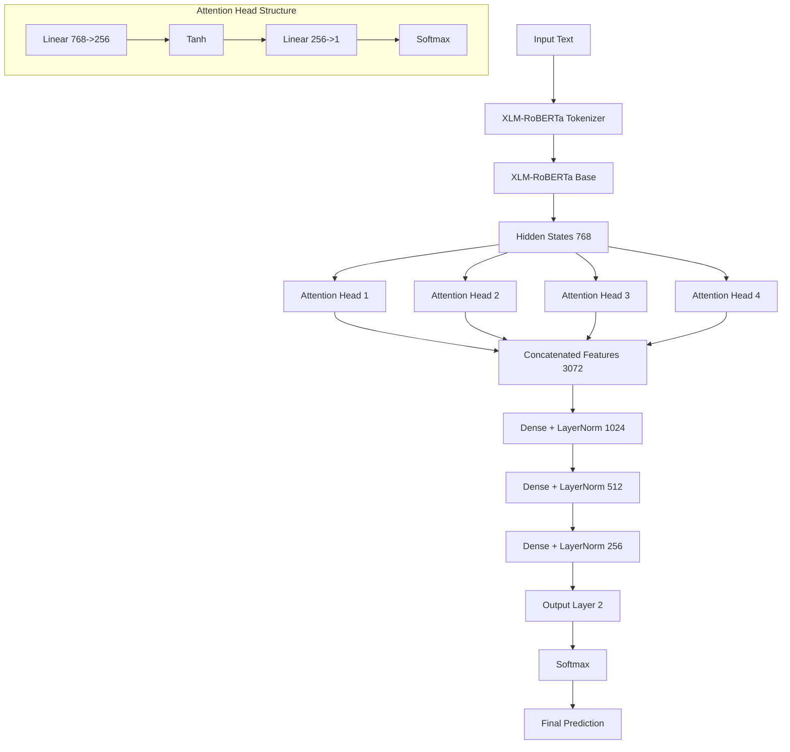

## Model Architecture

The model is built using XLM-RoBERTa as the base, with an additional multi-head attention mechanism to enhance the feature extraction.

```mermaid
graph TD
    A[Input Text] --> B[XLM-RoBERTa Tokenizer]
    B --> C[XLM-RoBERTa Base]
    C --> D[Hidden States 768]
    D --> E1[Attention Head 1]
    D --> E2[Attention Head 2]
    D --> E3[Attention Head 3]
    D --> E4[Attention Head 4]
    E1 --> F[Concatenated Features 3072]
    E2 --> F
    E3 --> F
    E4 --> F
    F --> G[Dense + LayerNorm 1024]
    G --> H[Dense + LayerNorm 512]
    H --> I[Dense + LayerNorm 256]
    I --> J[Output Layer 2]
    J --> K[Softmax]
    K --> L[Final Prediction]

    subgraph Attention Head Structure
    M[Linear 768->256]
    M --> N[Tanh]
    N --> O[Linear 256->1]
    O --> P[Softmax]
    end
```
